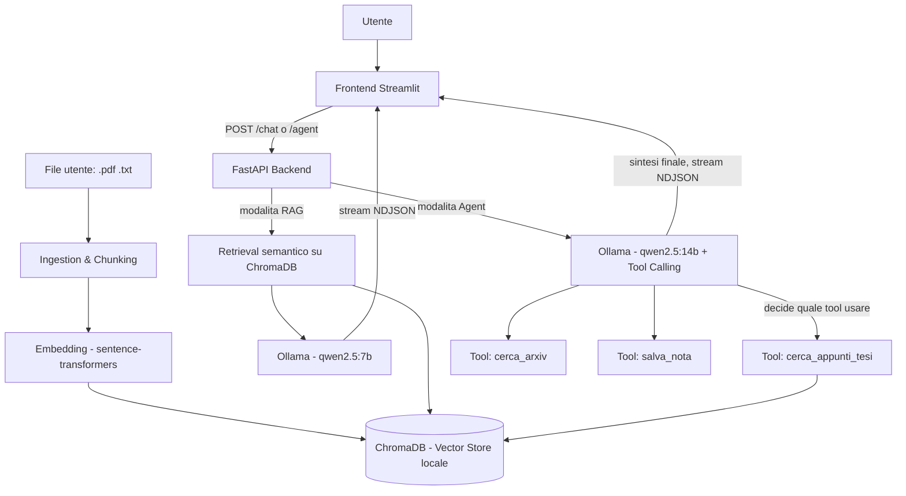

# Local CodeRAG

Sistema RAG (Retrieval-Augmented Generation) e AI Agent completamente locale, costruito su appunti di tesi personali (segmentazione binari ferroviari con YOLO/SAM 2). Espone due modalità di interazione — RAG puro e Agente con tool esterni — tramite API REST, con streaming delle risposte e memoria conversazionale multi-turno.

Progetto sviluppato come portfolio tecnico per candidature Junior AI/LLM Engineer, con focus su architetture RAG, Vector Database, function calling e sistemi conversazionali.

## Caratteristiche

- **RAG locale** su documenti personali (PDF, TXT), con chunking, embedding ed indicizzazione vettoriale
- **Zero dipendenze cloud**: nessuna API key esterna a pagamento, LLM eseguiti interamente in locale via Ollama
- **AI Agent con function calling**: instrada autonomamente le richieste tra ricerca nei documenti, ricerca su arXiv e salvataggio note
- **API REST** con FastAPI, autenticazione via API key, streaming delle risposte (NDJSON) e memoria di sessione
- **Frontend Streamlit** con selezione tra modalità RAG semplice e Agente

## Architettura



## Stack tecnologico

| Componente         | Tecnologia                                  |
|---------------------|----------------------------------------------|
| Linguaggio          | Python 3.10+                                 |
| Vector Database     | ChromaDB (persistente, locale)               |
| Embedding           | sentence-transformers (`all-MiniLM-L6-v2`)   |
| LLM locale          | Ollama — `qwen2.5:7b` (RAG), `qwen2.5:14b` (Agent) |
| Backend API         | FastAPI + Pydantic                           |
| Frontend            | Streamlit                                    |
| Estrazione PDF      | pypdf                                        |
| Config              | python-dotenv                                |

## Requisiti hardware

Testato su GPU NVIDIA RTX 3080 (10/12 GB VRAM) + 64 GB RAM. `qwen2.5:7b` gira comodamente in VRAM; `qwen2.5:14b` quantizzato (Q4) è consigliato per GPU con VRAM limitata.

## Setup

### 1. Ambiente Python

```bash
python -m venv venv
source venv/bin/activate  # su Windows: venv\Scripts\activate
pip install fastapi uvicorn chromadb sentence-transformers ollama pypdf python-dotenv streamlit requests
```

### 2. Ollama e modelli

Installare [Ollama](https://ollama.com), poi scaricare i modelli:

```bash
ollama pull qwen2.5:7b
ollama pull qwen2.5:14b
```

### 3. Variabili d'ambiente

Creare un file `.env` nella root del progetto:

```
API_KEY=scegli-una-chiave-segreta
```

### 4. Documenti da ingerire

Creare la cartella `./documenti` e inserire i file `.pdf` o `.txt` da indicizzare.

## Utilizzo

**1. Ingestion iniziale** (popola il Vector Database da file):

```bash
python ingest_reale.py
```

**2. Avviare il backend API:**

```bash
uvicorn api:app --reload
```

Documentazione interattiva disponibile su `http://127.0.0.1:8000/docs`.

**3. Avviare il frontend:**

```bash
streamlit run app_frontend.py
```

## Endpoint API

Tutti gli endpoint richiedono l'header `X-API-Key`.

| Metodo | Endpoint  | Descrizione                                                        |
|--------|-----------|---------------------------------------------------------------------|
| POST   | `/chat`   | RAG puro: retrieval semantico + generazione con `qwen2.5:7b`, risposta in streaming NDJSON |
| POST   | `/agent`  | Agente con tool calling (`qwen2.5:14b`), memoria di sessione, risposta in streaming NDJSON |
| POST   | `/ingest` | Aggiunge un documento testuale al Vector Database via API           |

**Esempio richiesta `/agent`:**

```json
{
  "domanda": "Come ho gestito i falsi positivi sulla ghiaia nella segmentazione?",
  "session_id": "sessione_demo_1"
}
```

**Formato risposta (streaming NDJSON)**, una riga JSON per evento:

```
{"type": "token", "content": "Per gestire i falsi..."}
{"type": "token", "content": " positivi sulla ghiaia..."}
{"type": "done", "fonte_utilizzata": "Agente tramite: cerca_appunti_tesi", "tempo_esecuzione_secondi": 3.42}
```

## Esempi di query

- *RAG semplice*: "Riassumi il meccanismo dei pesi spaziali usato in fase di training"
- *Agente → tool RAG*: "Cosa ho scritto sulla segmentazione con SAM 2?"
- *Agente → tool arXiv*: "Cerca paper recenti sulla segmentazione semantica di scene ferroviarie"
- *Agente → tool azione*: "Salva un riassunto di questa conversazione in un file"

## Struttura del progetto

```
.
├── api.py              # Backend FastAPI (RAG + Agent + Ingestion)
├── ingest_reale.py      # Script di ingestion da file (PDF/TXT)
├── app_frontend.py      # Interfaccia Streamlit
├── documenti/           # Cartella sorgente per i file da ingerire
├── chroma_db/           # Vector store persistente (generato automaticamente)
└── .env                 # Variabili d'ambiente (non versionato)
```

## Limitazioni note e sviluppi futuri

- La memoria conversazionale è mantenuta in RAM (`dict` Python) senza scadenza: adatto per demo, andrebbe sostituito con Redis o un database con TTL in un contesto di produzione
- L'endpoint `/ingest` non applica chunking sul testo ricevuto (a differenza della pipeline da file): un documento lungo inviato via API viene indicizzato come blocco unico
- Nessun test automatico presente al momento
- Il routing dell'agente su modelli locali di piccole dimensioni può occasionalmente essere impreciso nella scelta del tool; modelli più grandi (14B+) migliorano l'affidabilità a costo di maggiore latenza
- Possibili estensioni: retrieval ibrido (BM25 + semantico), valutazione quantitativa del retrieval (precision/recall), supporto opzionale a provider LLM cloud dietro la stessa interfaccia
