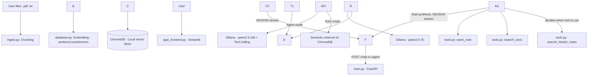

# Local CodeRAG

A fully local RAG (Retrieval-Augmented Generation) and AI Agent system, built on personal thesis notes (railway track segmentation with YOLO/SAM 2). It exposes two interaction modes — pure RAG and an Agent with external tools — through a REST API, with streaming responses and multi-turn conversational memory.

Built as a technical portfolio project for Junior AI/LLM Engineer applications, with a focus on RAG architectures, vector databases, function calling, and conversational systems.

## Features

* **Local RAG** over personal documents (PDF, TXT), with chunking, embedding, and vector indexing
* **Zero cloud dependencies**: no paid external API keys, LLMs run entirely locally via Ollama
* **AI Agent with function calling**: autonomously routes requests between document search, arXiv search, and note-saving
* **Modular REST API** (FastAPI) with API key authentication, streaming responses (NDJSON), and session memory
* **Streamlit frontend** with a toggle between Simple RAG and Agent mode
* **One-click Desktop Launcher**: unified execution script for concurrent backend and UI startup

## Architecture



## Tech Stack

|Component|Technology|
|-|-|
|Language|Python 3.10+|
|Vector Database|ChromaDB (persistent, local)|
|Embeddings|sentence-transformers (`all-MiniLM-L6-v2`)|
|Local LLM|Ollama — `qwen2.5:7b` (RAG), `qwen2.5:14b` (Agent)|
|Backend API|FastAPI + Pydantic|
|Frontend|Streamlit|
|PDF extraction|pypdf|
|Config|python-dotenv|

## Hardware Requirements

Tested on NVIDIA GPUs (RTX 3080 10GB / RTX 2060 6GB). 

- **GPUs with 6 GB VRAM**: Recommended to stick with `qwen2.5:7b` (fits entirely in VRAM with context). Running `qwen2.5:14b` requires partial CPU/RAM offloading, which significantly degrades generation speed.
- **GPUs with 10+ GB VRAM**: Can comfortably run `qwen2.5:14b` (Q4) entirely in VRAM for agentic workflows with low latency.

## Setup

### 1\. Python environment

```bash
python -m venv venv
source venv/bin/activate  # on Windows: venv\\Scripts\\activate
pip install -r requirements.txt
```

### 2\. Ollama and models

Install [Ollama](https://ollama.com), then pull the models:

```bash
ollama pull qwen2.5:7b
ollama pull qwen2.5:14b
```

### 3\. Environment variables

Create a `.env` file in the project root:

```
API\_KEY=choose-a-secret-key
```

### 4\. Documents to ingest

Create the `./documents` folder and place the `.pdf` or `.txt` files you want indexed inside it.

## Usage

**Fast Start (Unified)** (starts both API backend and Streamlit UI concurrently):

```bash
python launcher.py
```

## Manual Execution

**1. Initial ingestion** (populates the vector database from files):

```bash
python ingest.py
```

**2. Start the API backend:**

```bash
uvicorn main:app --reload
```

Interactive docs available at `http://127.0.0.1:8000/docs`.

**3. Start the frontend:**

```bash
streamlit run app\_frontend.py
```

## API Endpoints

All endpoints require the `X-API-Key` header.

|Method|Endpoint|Description|
|-|-|-|
|POST|`/chat`|Pure RAG: semantic retrieval + generation with `qwen2.5:7b`, NDJSON streaming response|
|POST|`/agent`|Agent with tool calling (`qwen2.5:14b`), session memory, NDJSON streaming response|
|POST|`/ingest`|Adds a text document to the vector database via the API (with automatic chunking)|

**Example `/agent` request:**

```json
{
  "question": "How did I handle false positives from gravel in the segmentation?",
  "session\_id": "demo\_session\_1"
}
```

**Response format (NDJSON streaming)**, one JSON line per event:

```
{"type": "token", "content": "To handle false positives..."}
{"type": "token", "content": " from gravel..."}
{"type": "done", "source\_used": "Agent via: search\_thesis\_notes", "execution\_time\_seconds": 3.42}
```

## Example Queries

* *Simple RAG*: "Summarize the spatial weighting mechanism used during training"
* *Agent → RAG tool*: "What did I write about segmentation with SAM 2?"
* *Agent → arXiv tool*: "Find recent papers on semantic segmentation of railway scenes"
* *Agent → action tool*: "Save a summary of this conversation to a file"

## Project Structure

```
.
├── main.py                     # FastAPI app: /chat, /agent, /ingest endpoints, streaming helpers
├── database.py                 # ChromaDB setup, persistent collection, embedding model
├── models.py                   # Pydantic models (ChatRequest, IngestRequest)
├── tools.py                    # Agent tools: search\_thesis\_notes, search\_arxiv, save\_note
├── ingest.py                   # File ingestion script (PDF/TXT) with chunking
├── app.py                      # Streamlit interface
├── launcher.py                 # Dual startup process script (Uvicorn + Streamlit)
├── documents/                  # Source folder for files to ingest
├── chroma\_db/                 # Persistent vector store (auto-generated)
├── requirements.txt            # Locked project dependencies
└── .env                        # Environment variables (not versioned)
```

## Known Limitations \& Future Work

* Conversational memory is kept in RAM (a plain Python `dict`) with no expiration: fine for a demo, but should be replaced with Redis or a TTL-backed store in a production context
* No automated tests yet
* Agent routing on small local models can occasionally be imprecise in tool selection; larger models (14B+) improve reliability at the cost of higher latency
* Possible extensions: hybrid retrieval (BM25 + semantic), quantitative retrieval evaluation (precision/recall), optional support for cloud LLM providers behind the same interface

